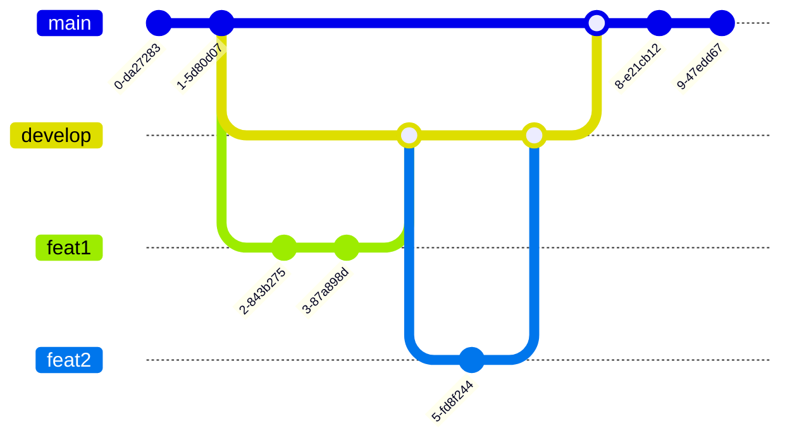

# Mermaid charts in GitHub

[Mermaid charts](https://mermaid-js.github.io/mermaid/) are SVG charts generated from simple markup. They're super useful for displaying logic visually.

## Benefits

- Visual communication can be clearer and easier to understand than written communication, especially for diverse teams with some language barriers.
- Adding visuals to a written explanation is an effective summary.
- Visuals make onboarding much more pleasant.
- A diagram makes it easy to identify bottlenecks, inefficiencies, or other edge cases in processes and situations.

##

I've only used them for `Sequence Diagrams` but it supports many other types of charts like `Flow Charts`, `Class Diagrams`, `State Diagrams`, `User Journeys`, `ER Diagrams`, `Git Graphs`, `Gantt Charts`, and `Pie Charts`.

For a Mermaid charts editor, I recommend [mermaid.live](https://mermaid.live/). It's free and updates in real time. You can create and edit your chart there, then paste it into

There's also a VS Code [extension](https://marketplace.visualstudio.com/items?itemName=bierner.markdown-mermaid) but if you type slowly, it will try to render your unfinished input so the integrated preview will look broken until syntax errors are corrected. It works well after you correct syntax errors.

## Use in GitHub

Mermaid charts should be in a Markdown [fenced code block](https://www.markdownguide.org/extended-syntax/#fenced-code-blocks) with `mermaid` as the language for syntax highlighting. The output is an SVG.

### Syntax:

\`\`\`mermaid

{diagramType}

{Mermaid chart code}

\`\`\`

GitHub-flavored Markdown only started supporting Mermaid Charts in 2022. See this [article](https://github.blog/2022-02-14-include-diagrams-markdown-files-mermaid/) for details.

## Sequence Diagrams

## Flow Chart

## Class Diagram

## State Diagram

## User Journeys

## ER Diagram

## Git Graph

## Gantt Charts

## Pie Chart

