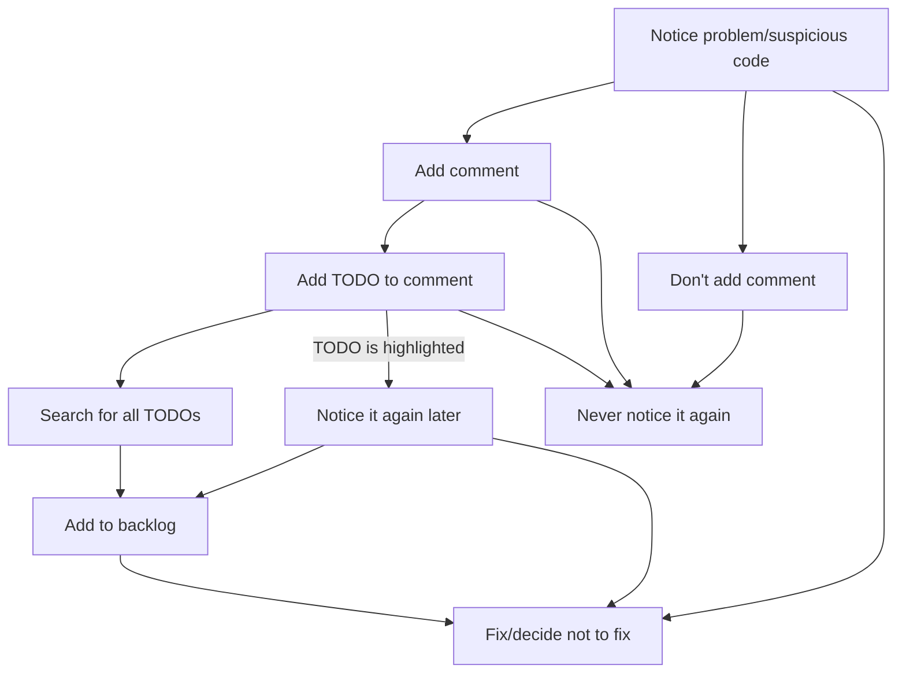

# `[Extension]` - `TODO` Highlight

## What is a `TODO`?

When working on a codebase, sometimes you see code that that should be fixed, refactored, or investigated later. If it's not related to your current task and not urgent, it's easy to tell yourself you'll remember to do it later. But you won't.

Switching to a proper TODO app can be too disruptive to the state of flow, so developers sometimes leave a comment like a 'note to self' to remind them to revisit that bit of code. Sometimes that comment has the keyword `TODO`.

## The problem with `TODO`s

`TODO`s are very convenient to write but it's also very easy to forget about those comments, especially in a huge codebase.

You can find `TODO`s in several large codebases such as [React](https://github.com/facebook/react/search?q=TODO). Often, those `TODO`s have existed for months or longer.

> 334 code results in facebook/react

The struggle is real. I've worked on codebases with `TODO`s that were 2+ years old. Unfortunately, this means those `TODO` items are all but forgotten. Ideally, they should be added to a proper task management with a backlog (like Jira) and triaged.

## Easier `TODO` management by highlighting

The extension [`TODO Highlight`](https://marketplace.visualstudio.com/items?itemName=wayou.vscode-todo-highlight) helps bring a bit more visibility to `TODO` comments without requiring any user action. It's like syntax highlighting for `TODO`s. It highlights `TODO` items and a few other useful keywords in comments. It can be customized to highlight whatever words you want in whatever file types you want in whatever way you want.

If `TODO`s are highlighted, it's easy to notice them during normal development. It's a useful reminder.

The `TODO` items stand out very nicely. Here's how it looks:

| Light Theme                                                                                                     | Dark Theme                                                                                                      |
| --------------------------------------------------------------------------------------------------------------- | --------------------------------------------------------------------------------------------------------------- |
|  |  |

## Listing all of the `TODO`s.

It's be ideal if you could gather **all** `TODO`s so they can be migrated to a backlog somewhere. Thankfully there's a feature for that too (though you could easily just use your IDE's global `Find and Replace` feature).

To use that feature, just open the Command Palette (with `Cmd/Ctrl + Shift + P`) and type `List highlighted annotations`. It may take a while for a large codebase. Here it is in action:

## Conclusion

The first step with most issues is recognizing that you have a problem. `TODO`s are great for capturing a problem but it's super easy for them to get lost among the other priorities the team has. Especially if the `TODO`s are never included in the backlog. Capturing the problem is the first good step. Highlighting them is the next constructive step.

Here's a flowchart (using [Mermaid charts](../markdown/mermaid-charts-in-github.md)) to illustrate the benefit of highlighting `TODO`s. I think it captures all the possibilities in this situation.

